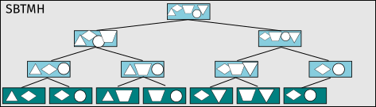
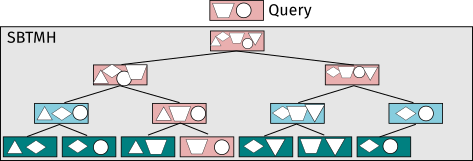

# Introduction

MinHash [Broder, 1997] is a technique for estimating the similarity of two or more datasets.
Expanding on the work pioneered by Mash [Ondov et al, 2016] and extended in our library sourmash [Brown and Irber, 2016],
we calculated signatures for 412 thousand microbial reads datasets on the Sequence Read Archive.
To be able to efficiently search for matches of these signatures in the RefSeq microbial genomes database we developed a new data structure based on Sequence Bloom Trees [Solomon and Kingsford, 2016] adapted for searching MinHash signatures (named SBTMH) to index signatures and made it available publicly.

*The SBTMH is a binary tree where leaf nodes are MinHash signatures and internal nodes are Bloom Filters. Each Bloom Filter can be queried for approximate membership of all the values from its children, and so the root node roughly represents all the values from all signatures in the tree.*

*Searching for similarity to a query signature involves checking for query elements present in each internal node, and if it doesn't reach the threshold the subtree is pruned. If a leaf is reached, it is returned as a match to the query signature.*

*Adding a new signature to SBTMH causes parent nodes to be updated, but other nodes are not affected. This means users from both SBTMH can benefit from increased availability of the data for the nodes that didn't change (and are shared among trees).*

## Further reading

- [Original repository, exploring the SBTMH implementation][1]
- [Pull request bringing SBTMH into sourmash][2]
- [Indexing RefSeq][3] and [extending the index][4]
- [Technical details on the system for computing minhashes from SRA][5]
- [Categorizing the 412k signatures][6]

[1]: https://github.com/luizirber/2016-sbt-minhash
[2]: https://github.com/dib-lab/sourmash/pull/45
[3]: http://ivory.idyll.org/blog/2016-sourmash-sbt.html
[4]: http://ivory.idyll.org/blog/2016-sourmash-sbt-more.html
[5]: http://blog.luizirber.org/2016/12/28/soursigs-arch-1/
[6]: http://ivory.idyll.org/blog/2017-sourmash-sra-microbial-wgs.html
